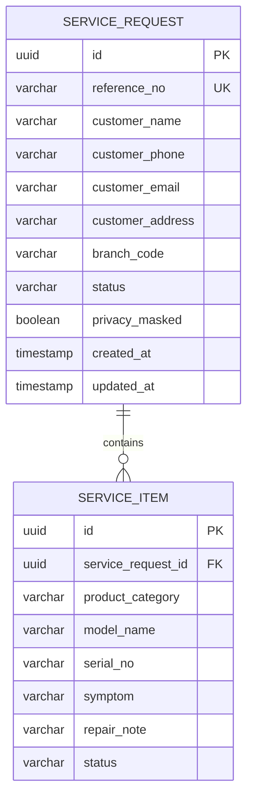

# ERD

```mermaid
erDiagram
    SERVICE_REQUEST ||--o{ SERVICE_ITEM : contains

    SERVICE_REQUEST {
        uuid id PK
        varchar reference_no UK
        varchar customer_name
        varchar customer_phone
        varchar customer_email
        varchar customer_address
        varchar branch_code
        varchar status
        boolean privacy_masked
        timestamp created_at
        timestamp updated_at
    }

    SERVICE_ITEM {
        uuid id PK
        uuid service_request_id FK
        varchar product_category
        varchar model_name
        varchar serial_no
        varchar symptom
        varchar repair_note
        varchar status
    }
```

## Modeling Note
한 번의 고객 접수에 여러 제품이 들어올 수 있으므로 `ServiceRequest 1 : N ServiceItem` 구조로 설계했습니다.
